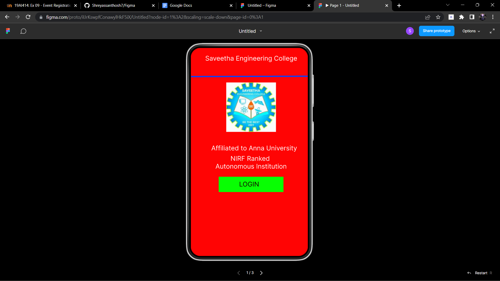
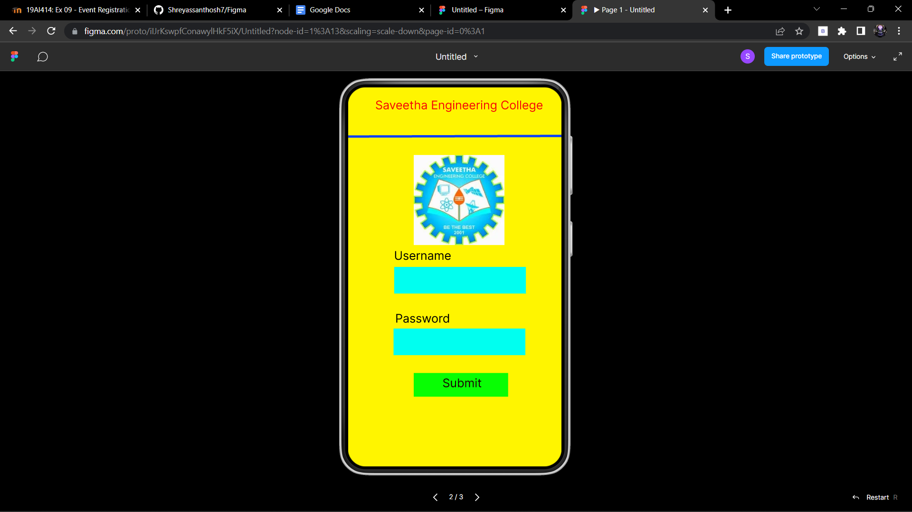
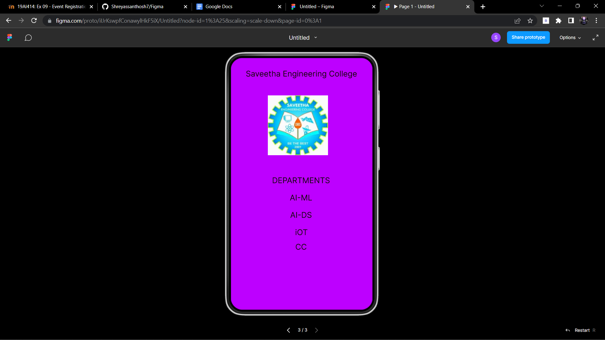

# Event Registration Web Application

## AIM:
To design, develop and deploy a web application for event registration.

## DESIGN STEPS:

### Step 1:
Create a new frame.

### Step 2:
Select any one preset size of your choice.

### Step 3:
Select the shapes you need.

### Step 4:
Import images as needed.

### Step 5:
Create pages based on your need and link them.

### Step 6:

Validate the HTML and CSS code.

### Step 6:

Publish the website in the given URL.

## DESIGN TOOL:
Figma

## code:
```
/* Home Page */
position: relative;
width: 360px;
height: 640px;

background: #FF0404;


/* Login Page */
position: relative;
width: 360px;
height: 640px;

background: #FFF500;


/* Saveetha Engineering College */
position: absolute;
width: 297px;
height: 37px;
left: 31px;
top: 28px;

font-family: 'Inter';
font-style: normal;
font-weight: 400;
font-size: 20px;
line-height: 24px;
text-align: center;

color: #130505;


/* Saveetha_Engineering_College 3 */
position: absolute;
width: 153px;
height: 152px;
left: 94px;
top: 95px;

background: url(Saveetha_Engineering_College.png);


/* DEPARTMENTS */
position: absolute;
width: 185px;
height: 29px;
left: 86px;
top: 299px;

font-family: 'Inter';
font-style: normal;
font-weight: 400;
font-size: 20px;
line-height: 24px;
text-align: center;

color: #100707;


/* AI-ML */
position: absolute;
width: 185px;
height: 29px;
left: 86px;
top: 343px;

font-family: 'Inter';
font-style: normal;
font-weight: 400;
font-size: 20px;
line-height: 24px;
text-align: center;

color: #100707;


/* AI-DS */
position: absolute;
width: 185px;
height: 29px;
left: 86px;
top: 387px;

font-family: 'Inter';
font-style: normal;
font-weight: 400;
font-size: 20px;
line-height: 24px;
text-align: center;

color: #100707;


/* iOT */
position: absolute;
width: 185px;
height: 29px;
left: 87px;
top: 431px;

font-family: 'Inter';
font-style: normal;
font-weight: 400;
font-size: 20px;
line-height: 24px;
text-align: center;

color: #100707;


/* CC */
position: absolute;
width: 185px;
height: 29px;
left: 86px;
top: 468px;

font-family: 'Inter';
font-style: normal;
font-weight: 400;
font-size: 20px;
line-height: 24px;
text-align: center;

color: #100707;
```
## OUTPUT:





## RESULT:
The program to design, develop and deploy a web application for event registration is completed successfully.